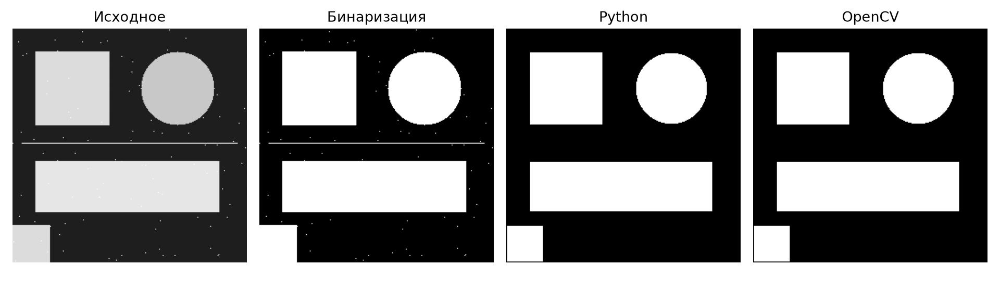

# Лабораторная работа №1

Вариант 7: эрозия с ядром 3×3.

Цель: реализовать алгоритм обработки изображений вручную и через библиотеку, сравнить время работы.

## 1. Теоретическая база

Эрозия уменьшает белые области бинарного изображения. Пиксель остаётся белым, только если все девять пикселей в его окрестности 3×3 белые. Иначе он становится чёрным. Поэтому одиночные точки и тонкие линии исчезают.

Ядро представляет собой квадрат 3×3 из единиц. Пиксели за границей изображения считаются чёрными.

## 2. Описание разработанной системы

Программа написана на Python. В `main.py` изображение читается в оттенках серого, затем бинаризуется с порогом 127. Значения выше порога становятся 255, остальные становятся 0.

В `erosion.py` находятся две реализации:

- `erode_opencv`: вызов `cv2.erode` с ядром 3×3.
- `erode_native`: обход изображения циклами и поиск минимального значения среди девяти соседних пикселей. NumPy используется только для хранения и преобразования данных.

Программа выводит время каждого варианта и сохраняет бинарное изображение и оба результата в папку `results`.

### Запуск

Из корня репозитория:

```shell
pip install -r requirements.txt
cd lab1
python main.py
```

Для своего изображения и другого порога:

```shell
python main.py photo.jpg --threshold 150
```

## 3. Результаты работы и тестирования системы

Использовано изображение 256×256 с фигурами, белыми точками и тонкой линией.



Результаты двух реализаций совпали. Белые точки и тонкая линия исчезли, крупные фигуры уменьшились. Число белых пикселей сократилось с 24 828 до 23 217.

Время измеряется через `perf_counter` непосредственно при запуске. Чтение файла, бинаризация и сохранение в замер не входят. Один запуск даёт приблизительную оценку, значения могут меняться.

| Реализация | Время в проверочном запуске, мс |
| --- | ---: |
| Python | 40.495 |
| OpenCV | 6.388 |

## 4. Выводы по работе

Эрозия реализована вручную и через OpenCV. Обе версии дают одинаковое изображение. OpenCV работает быстрее ручных циклов Python. Эрозия подходит для удаления мелких белых объектов, но также удаляет тонкие детали.

## 5. Использованные источники

1. [OpenCV: морфологические операции](https://docs.opencv.org/4.x/d9/d61/tutorial_py_morphological_ops.html).
2. [OpenCV: функция erode и обработка границ](https://docs.opencv.org/4.x/d4/d86/group__imgproc__filter.html).
3. [Python: perf_counter](https://docs.python.org/3/library/time.html#time.perf_counter).
